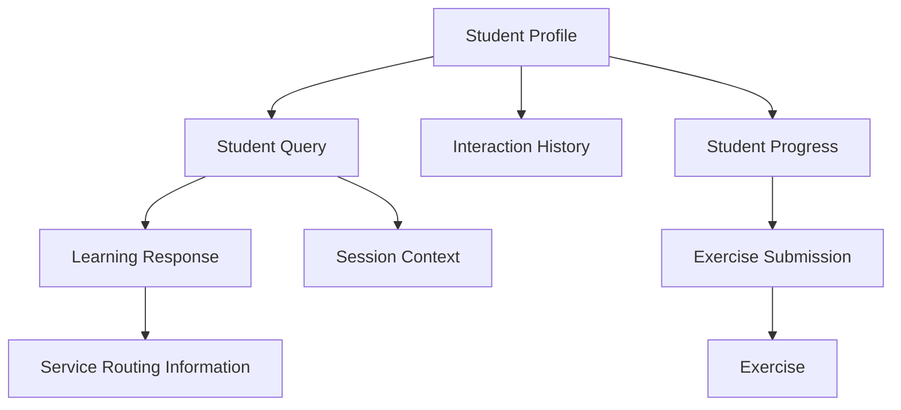

# Data Model: LearnFlow Backend Services

## Entity Relationships

## Core Entities

### 1. Student Profile
- **Description**: Contains authentication information and user preferences for the learning platform
- **Fields**:
  - `id`: UUID (Primary Key)
  - `email`: String (Unique, Required)
  - `password_hash`: String (Required, encrypted)
  - `first_name`: String (Optional)
  - `last_name`: String (Optional)
  - `role`: Enum ['student', 'teacher'] (Default: 'student')
  - `created_at`: DateTime (Auto-generated)
  - `updated_at`: DateTime (Auto-generated)
  - `preferences`: JSON (Optional, for user settings)
- **Relationships**:
  - One-to-Many with Student Query
  - One-to-Many with Interaction History
  - One-to-One with Student Progress
- **Validation Rules**:
  - Email must be valid format
  - Password must meet security requirements
  - Role must be one of allowed values

### 2. Student Query
- **Description**: Represents a student's learning request, containing query text, student ID, session ID, and context
- **Fields**:
  - `id`: UUID (Primary Key)
  - `student_id`: UUID (Foreign Key to Student Profile, Required)
  - `session_id`: String (Required)
  - `query_text`: Text (Required, Max 10000 characters)
  - `query_type`: Enum ['concept', 'debug', 'exercise', 'other'] (Required)
  - `context`: JSON (Optional, for additional context)
  - `submitted_at`: DateTime (Auto-generated)
  - `processed_at`: DateTime (Optional)
  - `status`: Enum ['pending', 'routed', 'processing', 'completed', 'failed'] (Default: 'pending')
- **Relationships**:
  - Many-to-One with Student Profile
  - One-to-Many with Learning Response
  - One-to-One with Session Context
- **Validation Rules**:
  - Query text must not be empty
  - Status must be one of allowed values
  - Student ID must reference existing student

### 3. Learning Response
- **Description**: Contains the AI-generated response to student queries, including explanations, code, or exercise feedback
- **Fields**:
  - `id`: UUID (Primary Key)
  - `query_id`: UUID (Foreign Key to Student Query, Required)
  - `service_type`: Enum ['triage', 'concepts', 'debug', 'exercise'] (Required)
  - `response_content`: Text (Required)
  - `response_format`: Enum ['text', 'code', 'exercise', 'feedback'] (Required)
  - `ai_provider`: String (e.g., 'OpenAI', Required)
  - `ai_model`: String (e.g., 'gpt-4', Required)
  - `tokens_used`: Integer (Optional, for cost tracking)
  - `confidence_score`: Decimal (0-1, Optional)
  - `created_at`: DateTime (Auto-generated)
  - `feedback_rating`: Integer (1-5, Optional)
  - `feedback_comment`: Text (Optional)
- **Relationships**:
  - Many-to-One with Student Query
  - One-to-Many with Service Routing Information
- **Validation Rules**:
  - Response content must not be empty
  - Confidence score must be between 0 and 1
  - Feedback rating must be between 1 and 5

### 4. Service Routing Information
- **Description**: Metadata that determines which specialist service should handle a particular query
- **Fields**:
  - `id`: UUID (Primary Key)
  - `query_id`: UUID (Foreign Key to Student Query, Required)
  - `response_id`: UUID (Foreign Key to Learning Response, Optional)
  - `original_service`: String (Required, e.g., 'triage')
  - `target_service`: String (Required, e.g., 'concepts', 'debug', 'exercise')
  - `routing_reason`: Text (Optional, reason for routing)
  - `routing_timestamp`: DateTime (Auto-generated)
  - `message_id`: String (For Kafka message tracking)
- **Relationships**:
  - Many-to-One with Student Query
  - Many-to-One with Learning Response
- **Validation Rules**:
  - Target service must be one of allowed services
  - Original and target services must differ

### 5. Session Context
- **Description**: Information about the ongoing learning session that helps personalize responses
- **Fields**:
  - `id`: UUID (Primary Key)
  - `query_id`: UUID (Foreign Key to Student Query, Required)
  - `session_data`: JSON (Required, session-specific context)
  - `current_module`: String (Optional, e.g., 'loops', 'functions')
  - `current_difficulty`: Enum ['beginner', 'intermediate', 'advanced'] (Optional)
  - `learning_path`: Array of Strings (Optional, sequence of topics)
  - `session_started_at`: DateTime (Auto-generated)
  - `last_activity_at`: DateTime (Auto-generated)
  - `session_duration`: Integer (Seconds, Optional)
- **Relationships**:
  - One-to-One with Student Query
- **Validation Rules**:
  - Current difficulty must be one of allowed values

### 6. Interaction History
- **Description**: Records of student queries, responses, and learning progress over time
- **Fields**:
  - `id`: UUID (Primary Key)
  - `student_id`: UUID (Foreign Key to Student Profile, Required)
  - `query_id`: UUID (Foreign Key to Student Query, Required)
  - `response_id`: UUID (Foreign Key to Learning Response, Required)
  - `interaction_type`: Enum ['query', 'exercise_submission', 'progress_update'] (Required)
  - `summary`: Text (Brief summary of interaction)
  - `engagement_time`: Integer (Seconds spent on interaction)
  - `success_indicators`: JSON (Metrics about learning success)
  - `created_at`: DateTime (Auto-generated)
  - `updated_at`: DateTime (Auto-generated)
- **Relationships**:
  - Many-to-One with Student Profile
  - Many-to-One with Student Query
  - Many-to-One with Learning Response
- **Validation Rules**:
  - Engagement time must be non-negative

### 7. Student Progress
- **Description**: Tracks student learning progress across different modules and concepts
- **Fields**:
  - `id`: UUID (Primary Key)
  - `student_id`: UUID (Foreign Key to Student Profile, Required)
  - `module_name`: String (Required, e.g., 'variables', 'loops', 'functions')
  - `mastery_percentage`: Decimal (0-100, Required)
  - `attempts_count`: Integer (Default: 0)
  - `success_count`: Integer (Default: 0)
  - `last_practiced_at`: DateTime (Optional)
  - `streak_days`: Integer (Current consecutive days practicing)
  - `total_learning_time`: Integer (Minutes, Optional)
  - `completed_exercises`: Integer (Count of completed exercises)
  - `created_at`: DateTime (Auto-generated)
  - `updated_at`: DateTime (Auto-generated)
- **Relationships**:
  - Many-to-One with Student Profile
- **Validation Rules**:
  - Mastery percentage must be between 0 and 100
  - Attempts count must be non-negative
  - Success count must be <= attempts count

### 8. Exercise
- **Description**: Defines coding exercises that can be generated and assigned to students
- **Fields**:
  - `id`: UUID (Primary Key)
  - `title`: String (Required)
  - `topic`: String (Required, e.g., 'loops', 'functions', 'data structures')
  - `difficulty`: Enum ['easy', 'medium', 'hard'] (Required)
  - `problem_description`: Text (Required)
  - `starter_code`: Text (Optional, code template for student)
  - `solution_code`: Text (Required, correct solution)
  - `test_cases`: JSON (Array of test cases for validation)
  - `hints`: Array of Strings (Optional, hints for students)
  - `estimated_completion_time`: Integer (Minutes, Optional)
  - `tags`: Array of Strings (Optional, e.g., 'python-basics', 'loops')
  - `created_by`: UUID (Foreign Key to Student Profile, if created by teacher)
  - `created_at`: DateTime (Auto-generated)
  - `updated_at`: DateTime (Auto-generated)
- **Relationships**:
  - Many-to-One with Student Profile (for creator)
  - One-to-Many with Exercise Submission
- **Validation Rules**:
  - Difficulty must be one of allowed values
  - Solution code must be valid Python code
  - Test cases must be properly formatted

### 9. Exercise Submission
- **Description**: Records student submissions for exercises with grading results
- **Fields**:
  - `id`: UUID (Primary Key)
  - `exercise_id`: UUID (Foreign Key to Exercise, Required)
  - `student_id`: UUID (Foreign Key to Student Profile, Required)
  - `submission_code`: Text (Required, student's code submission)
  - `submission_time`: DateTime (Auto-generated)
  - `grade`: Decimal (0-100, Required)
  - `status`: Enum ['pending', 'grading', 'graded', 'manual_review'] (Default: 'pending')
  - `feedback`: Text (Optional, from AI or teacher)
  - `automated_tests_passed`: Integer (Required)
  - `total_tests`: Integer (Required)
  - `execution_time_ms`: Integer (Optional, runtime of submitted code)
  - `memory_usage_kb`: Integer (Optional, memory usage of submitted code)
  - `grader`: Enum ['ai', 'teacher', 'system'] (Required)
  - `graded_at`: DateTime (Optional)
- **Relationships**:
  - Many-to-One with Exercise
  - Many-to-One with Student Profile
- **Validation Rules**:
  - Grade must be between 0 and 100
  - Status must be one of allowed values
  - Automated tests passed must be <= total tests